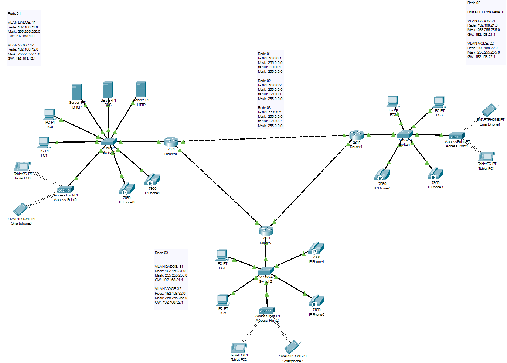

# Projeto de Redes Convergentes

-   Alunos:
    -   Gabriel Fonseca Feitosa - 2111066
    -   Pedro Lucas Ribeiro - 2111131

## Introdução



&nbsp;&nbsp;&nbsp;&nbsp;&nbsp;&nbsp;Projeto de rede feito no Cisco Package Tracer, para a disciplina Projeto de Redes Convergentes do 6º semestre do curso de Ciência da Computação da UNIFOR.

&nbsp;&nbsp;&nbsp;&nbsp;&nbsp;&nbsp;O projeto de rede utiliza-se de um amalgamo de teorias que foram aprendidas no decorrer da disciplina, para atingir o objetivo de configurar uma rede que satisfaça as especificações realizadas pelo professor, com fins de avaliação e aprendizado.

&nbsp;&nbsp;&nbsp;&nbsp;&nbsp;&nbsp;Dentre as tecnologias utilizadas, temos os principais protocolos de troca de dados em rede, como UDP, HTTP e o pai de todos os supracitados, o TCP/IP. Utilizaremos também conceitos de endereçamento como os IPs definidos estaticamente e dinamicamente através do DHCP, servidores DNS internos e externos às redes para resolução de nomes de domínio, LANs virtuais para isolamento e segmentação das redes em seus próprios ambientes e, finalmente, o protocolo RIP para roteamento das requisições.

## Dados de configuração das redes

### Tabela VLAN de DADOS

| Rede | Interface VLAN |     Host     |     Mask      |   Gateway    |   Broadcast    |      Servidor DHCP      | DHCP Interno |          Range DHCP           |      Servidor DNS       |      Servidor HTTP      |
| :--: | :------------: | :----------: | :-----------: | :----------: | :------------: | :---------------------: | :----------: | :---------------------------: | :---------------------: | :---------------------: |
|  1   |       11       | 192.168.11.0 | 255.255.255.0 | 192.168.11.1 | 192.168.11.255 | 192.168.11.2 (Estático) |      -       | 192.168.11.5 - 192.168.11.254 | 192.168.11.3 (Estático) | 192.168.11.4 (Estático) |
|  2   |       21       | 192.168.21.0 | 255.255.255.0 | 192.168.21.1 | 192.168.21.255 | 192.168.11.2 (Rede 01)  |      -       | 192.168.21.5 - 192.168.21.254 |            -            |            -            |
|  3   |       31       | 192.168.31.0 | 255.255.255.0 | 192.168.31.1 | 192.168.31.255 |            -            | 192.168.31.1 |               -               |            -            |            -            |

&nbsp;&nbsp;&nbsp;&nbsp;&nbsp;&nbsp;Com fins de organização e facilidade de leitura e interpretação, escolhemos as interfaces 11, 21 e 31 para as redes 01, 02 e 03 respectivamente, que é refletido em seus valores de host, que por consequência também reflete em todos os endereços restantes, como o gateway, broadcast, servidor de DHCP para o caso da rede 03 que é interno, e os servidores DNS e HTTP aonde se aplica (Apenas a rede 01 possui ditos servidores.).

&nbsp;&nbsp;&nbsp;&nbsp;&nbsp;&nbsp;A tabela acima refere-se aos valores e configuração do serviço de transmissão de dados especificamente, utilizando a interface do tipo FastEthernet. Pode-se notar que na rede 01 há 3 endereços IP estáticos, que são referentes ao servidor DHCP, DNS e HTTP. O servidor DHCP tem a necessidade de ser estático por ser utilizado como servidor DHCP também na rede 02, como nas especificações da rede descritas pelo professor. Os servidores DNS e HTTP necessitam de ser estáticos pois também foi especificado que todos os hosts devem ser capazes de acessar o site, que reside no servidor HTTP e terá seu endereço cadastrado no DNS com o nome `server02`. Os IPs estáticos dos servidores HTTP e DNS tornam o site acessível, através do nome, para todos os hosts da rede completa, inclusive os dispositivos fora da rede 01, onde o servidor HTTP reside.

### Tabela VLAN de VOIP

| Rede | Interface VLAN |     Host     |     Mask      |   Gateway    |          DHCP          | Broadcast Voz  |        Range DHCP Voz         |
| :--: | :------------: | :----------: | :-----------: | :----------: | :--------------------: | :------------: | :---------------------------: |
|  1   |       12       | 192.168.12.0 | 255.255.255.0 | 192.168.12.1 |      192.168.11.2      | 192.168.12.255 | 192.168.12.5 - 192.168.12.254 |
|  2   |       22       | 192.168.22.0 | 255.255.255.0 | 192.168.22.1 | 192.168.11.2 (Rede 01) | 192.168.22.255 | 192.168.22.5 - 192.168.22.254 |
|  3   |       32       | 192.168.32.0 | 255.255.255.0 | 192.168.32.1 | 192.168.31.1 (Interno) | 192.168.32.255 |               -               |

## Equipamentos utilizados

-   Rede 01:
    -   1 x Roteador 2811 + Módulo FastEthernet NM-1FE-TX
    -   1 x Switch 2950-24
    -   3 x Servidores
    -   2 x PCs
    -   2 x IP Phones 7960
    -   1 x AccessPoint-PT
    -   1 x SmartPhone-PT
    -   1 x TabletPC-PT

---

-   Rede 02
    -   1 x Roteador 2811 + Módulo FastEthernet NM-1FE-TX
    -   1 x Switch 2950-24
    -   2 x PCs
    -   2 x IP Phones 7960
    -   1 x AccessPoint-PT
    -   1 x SmartPhone-PT
    -   1 x TabletPC-PT

---

-   Rede 03
    -   1 x Roteador 2811 + Módulo FastEthernet NM-1FE-TX
    -   1 x Switch 2950-24
    -   2 x PCs
    -   2 x IP Phones 7960
    -   1 x AccessPoint-PT
    -   1 x SmartPhone-PT
    -   1 x TabletPC-PT

---

-   Total:
    -   3 x Roteadores 2811 + Módulo FastEthernet NM-1FE-TX
    -   3 x Switch's 2950-24
    -   3 x Servidores
    -   6 x PCs
    -   6 x IP Phone 7960
    -   3 x AccessPoint-PT
    -   3 x SmartPhone-PT
    -   3 x TabletPC-PT

## Comandos para configuração das redes

A seguir serão apresentados os comandos necessários para configurar o hardware utilizado em cada uma das três redes.

### Rede 1

-   Equipamento: Switch

```sh
Switch> en
Switch# conf t
    > Enter configuration commands, one per line. End with CNTL/Z.
Switch(config)# vlan 11
Switch(config-vlan)# name dados
Switch(config-vlan)# exit
Switch(config)# vlan 12
Switch(config-vlan)# name voice
Switch(config-vlan)# exit
Switch(config)# int fa 0/1
Switch(config-if)# switchport mode trunk
Switch(config-if)# exit
Switch(config)# int range fa 0/2-24
Switch(config-if-range)# switchport mode access
Switch(config-if-range)# switchport access vlan 11
Switch(config-if-range)# exit
Switch(config)# int range fa 0/23-24
Switch(config-if-range)# switchport voice vlan 12
Switch(config-if-range)# exit
Switch(config)# exit
```

-   Equipamento: Router (Interfaces)

```sh
Router> en
Router# conf t
    > Enter configuration commands, one per line. End with CNTL/Z.
Router(config)# int fa 0/0
Router(config-if)# no shutdown
    > %LINK-5-CHANGED: Interface FastEthernet0/0, changed state to up
Router(config-if)# exit
Router(config)# int fa 0/1
Router(config-if)# no shutdown
    > %LINK-5-CHANGED: Interface FastEthernet0/1, changed state to up
Router(config-if)# ip address 10.0.0.1 255.0.0.0
Router(config-if)# exit
Router(config)# int fa 1/0
Router(config-if)# no shutdown
    > %LINK-5-CHANGED: Interface FastEthernet1/0, changed state to up
Router(config-if)# ip address 11.0.0.1 255.0.0.0
Router(config-if)# exit
Router(config)# int fastEthernet 0/0.11
    > %LINK-5-CHANGED: Interface FastEthernet0/0.11, changed state to up
Router(config-subif)# ip add
Router(config-subif)# encapsulation dot1Q 11
Router(config-subif)# ip address 192.168.11.1 255.255.255.0
Router(config-subif)# exit
Router(config)# int fastEthernet 0/0.12
    > %LINK-5-CHANGED: Interface FastEthernet0/0.12, changed state to up
Router(config-subif)# encapsulation dot1Q 12
Router(config-subif)# ip address 192.168.12.1 255.255.255.0
Router(config-subif)# exit
Router(config)# end
    > %SYS-5-CONFIG_I: Configured from console by console
    > Building configuration...
    > [OK]
```

-   Equipamento: Router (Telefonia)

```sh
Router# conf t
    > Enter configuration commands, one per line. End with CNTL/Z.
Router(config)# int fastEthernet 0/0.12
Router(config-subif)# ip helper-address 192.168.11.2
Router(config-subif)# exit
Router(config)# telephony-service
Router(config-telephony)# max-dn 10
Router(config-telephony)# max-ephones 10
Router(config-telephony)# ip source-address 192.168.12.1 port 2000
Router(config-telephony)# auto assign 1 to 10
Router(config-telephony)# exit
Router(config)# ephone-dn 1
Router(config-ephone-dn)# %LINK-3-UPDOWN: Interface ephone_dsp DN 1.1, changed state to up
Router(config-ephone-dn)# number 100
Router(config-ephone-dn)# exit
Router(config)# ephone-dn 2
Router(config-ephone-dn)# %LINK-3-UPDOWN: Interface ephone_dsp DN 2.1, changed state to up
Router(config-ephone-dn)# number 101
    > %IPPHONE-6-REGISTER: ephone-1 IP:192.168.12.6 Socket:2 DeviceType:Phone has registered.
    > %IPPHONE-6-REGISTER: ephone-2 IP:192.168.12.8 Socket:2 DeviceType:Phone has registered.
Router(config-ephone-dn)# exit
Router(config)# end
    > %SYS-5-CONFIG_I: Configured from console by console
    > Building configuration...
    > [OK]
```

-   Equipamento: Router (Rotas)

```sh
Router> en
Router# config t
    > Enter configuration commands, one per line. End with CNTL/Z.
Router(config)# router rip
Router(config-router)# network 192.168.11.0
Router(config-router)# network 192.168.12.0
Router(config-router)# network 10.0.0.0
Router(config-router)# network 11.0.0.0
Router(config-router)# end
Router#
    > %SYS-5-CONFIG_I: Configured from console by console
    > Building configuration...
    > [OK]
```

-   Equipamento: Router (Rotas VOIP)

```sh
Router# config t
    > Enter configuration commands, one per line. End with CNTL/Z.
Router(config)# dial-peer voice 1 voip
Router(config-dial-peer)# destination-pattern 300
Router(config-dial-peer)# session target ipv4:11.0.0.2
Router(config-dial-peer)# exit
Router(config)# dial-peer voice 2 voip
Router(config-dial-peer)# destination-pattern 301
Router(config-dial-peer)# session target ipv4:11.0.0.2
Router(config-dial-peer)# exit
Router(config)# dial-peer voice 3 voip
Router(config-dial-peer)# destination-pattern 200
Router(config-dial-peer)# session target ipv4:10.0.0.2
Router(config-dial-peer)# exit
Router(config)# dial-peer voice 4 voip
Router(config-dial-peer)# destination-pattern 201
Router(config-dial-peer)# session target ipv4:10.0.0.2
Router(config-dial-peer)# exit
Router(config)# exit
    > %SYS-5-CONFIG_I: Configured from console by console
    > Building configuration...
    > [OK]
```

### Rede 2

-   Equipamento: Switch

```sh
Switch> en
Switch# conf t
    > Enter configuration commands, one per line.  End with CNTL/Z.
Switch(config)# vlan 21
Switch(config-vlan)# name dados
Switch(config-vlan)# exit
Switch(config)# vlan 22
Switch(config-vlan)# name voice
Switch(config-vlan)# exit
Switch(config)# int fa 0/1
Switch(config-if)# switchport mode trunk
Switch(config-if)# exit
Switch(config)# int range fa 0/2-24
Switch(config-if-range)# switchport mode access
Switch(config-if-range)# switchport access vlan 21
Switch(config-if-range)# exit
Switch(config)# int range fa 0/23-24
Switch(config-if-range)# switchport voice vlan 22
Switch(config-if-range)# exit
Switch(config)# exit
    > %SYS-5-CONFIG_I: Configured from console by console
    > Building configuration...
    > [OK]
```

-   Equipamento: Router (Interfaces)

```sh
Router> en
Router# conf t
    Enter configuration commands, one per line.  End with CNTL/Z.
Router(config)# int fa 0/0
Router(config-if)# no shutdown
    > %LINK-5-CHANGED: Interface FastEthernet0/0, changed state to up
Router(config-if)# exit
Router(config)# int fa 0/1
Router(config-if)# no shutdown
    > %LINK-5-CHANGED: Interface FastEthernet0/1, changed state to up
Router(config-if)# ip address 10.0.0.2 255.0.0.0
Router(config-if)# exit
Router(config)# int fa 1/0
Router(config-if)# no shutdown
    > %LINK-5-CHANGED: Interface FastEthernet1/0, changed state to up
Router(config-if)# ip address 12.0.0.1 255.0.0.0
Router(config-if)# exit
Router(config)# int fastEthernet 0/0.21
    > %LINK-5-CHANGED: Interface FastEthernet0/0.21, changed state to up
Router(config-subif)# ip add
Router(config-subif)# encapsulation dot1Q 21
Router(config-subif)# ip address 192.168.21.1 255.255.255.0
Router(config-subif)# ip helper-address 192.168.11.2
Router(config-subif)# exit
Router(config)# int fastEthernet 0/0.22
    > %LINK-5-CHANGED: Interface FastEthernet0/0.22, changed state to up
Router(config-subif)# encapsulation dot1Q 22
Router(config-subif)# ip address 192.168.22.1 255.255.255.0
Router(config-subif)# ip helper-address 192.168.11.2
Router(config-subif)# exit
Router(config)# exit
    > %SYS-5-CONFIG_I: Configured from console by console
    > Building configuration...
    > [OK]
```

-   Equipamento: Router (Telefonia)

```sh
Router> en
Router# conf t
    > Enter configuration commands, one per line.  End with CNTL/Z.
Router(config)# telephony-service
Router(config-telephony)# max-dn 10
Router(config-telephony)# max-ephones 10
Router(config-telephony)# ip source-address 192.168.22.1 port 2000
Router(config-telephony)# auto assign 1 to 10
Router(config-telephony)# exit
Router(config)# ephone-dn 1
Router(config-ephone-dn)# %LINK-3-UPDOWN: Interface ephone_dsp DN 1.1, changed state to up
Router(config-ephone-dn)# number 200
Router(config-ephone-dn)# exit
Router(config)# ephone-dn 2
Router(config-ephone-dn)# %LINK-3-UPDOWN: Interface ephone_dsp DN 2.1, changed state to up
Router(config-ephone-dn)# number 201
    > %IPPHONE-6-REGISTER: ephone-1 IP:192.168.22.6 Socket:2 DeviceType:Phone has registered.
    > %IPPHONE-6-REGISTER: ephone-2 IP:192.168.22.8 Socket:2 DeviceType:Phone has registered.
Router(config-ephone-dn)# exit
Router(config)# end
    > %SYS-5-CONFIG_I: Configured from console by console
    > Building configuration...
    > [OK]
```

-   Equipamento: Router (Rotas)

```sh
Router> en
Router# config t
    > Enter configuration commands, one per line.  End with CNTL/Z.
Router(config)# router rip
Router(config-router)# network 192.168.21.0
Router(config-router)# network 192.168.22.0
Router(config-router)# network 10.0.0.0
Router(config-router)# network 12.0.0.0
Router(config-router)# end
    > %SYS-5-CONFIG_I: Configured from console by console
    > Building configuration...
    > [OK]
```

-   Equipamento: Router (Rotas VOIP)

```sh
Router# config t
    > Enter configuration commands, one per line.  End with CNTL/Z.
Router(config)# dial-peer voice 1 voip
Router(config-dial-peer)# destination-pattern 300
Router(config-dial-peer)# session target ipv4:12.0.0.2
Router(config-dial-peer)# exit
Router(config)# dial-peer voice 2 voip
Router(config-dial-peer)# destination-pattern 301
Router(config-dial-peer)# session target ipv4:12.0.0.2
Router(config-dial-peer)# exit
Router(config)# dial-peer voice 3 voip
Router(config-dial-peer)# destination-pattern 100
Router(config-dial-peer)# session target ipv4:10.0.0.1
Router(config-dial-peer)# exit
Router(config)# dial-peer voice 4 voip
Router(config-dial-peer)# destination-pattern 101
Router(config-dial-peer)# session target ipv4:10.0.0.1
Router(config-dial-peer)# exit
Router(config)# exit
    > %SYS-5-CONFIG_I: Configured from console by console
    > Building configuration...
    > [OK]
```

### Rede 3

-   Equipamento: Switch

```sh
Switch> en
Switch# conf t
    > Enter configuration commands, one per line.  End with CNTL/Z.
Switch(config)# vlan 32
Switch(config-vlan)# name voice
Switch(config-vlan)# exit
Switch(config)# vlan 31
Switch(config-vlan)# name dados
Switch(config-vlan)# exit
Switch(config)# int fa 0/1
Switch(config-if)# switchport mode trunk
Switch(config-if-range)# exit
Switch(config)# int range fa 0/2-24
Switch(config-if-range)# switchport mode access
Switch(config-if-range)# switchport access vlan 31
Switch(config-if-range)# exit
Switch(config)# int range fa 0/23-24
Switch(config-if-range)# switchport voice vlan 32
Switch(config-if-range)# exit
Switch(config)# end
Switch#
    > %SYS-5-CONFIG_I: Configured from console by console
    > Building configuration...
    > [OK]
```

-   Equipamento: Router (Interfaces)

```sh
Router> en
Router# conf t
    > Enter configuration commands, one per line.  End with CNTL/Z.
Router(config)# int fa 0/0
Router(config-if)# no shutdown
    > %LINK-5-CHANGED: Interface FastEthernet0/0, changed state to up
Router(config-if)# exit
Router(config)# int fa 0/1
Router(config-if)# no shutdown
    > %LINK-5-CHANGED: Interface FastEthernet0/1, changed state to up
Router(config-if)# ip address 11.0.0.2 255.0.0.0
Router(config-if)# exit
Router(config)# int fa 1/0
Router(config-if)# no shutdown
    > %LINK-5-CHANGED: Interface FastEthernet1/0, changed state to up
Router(config-if)# ip address 12.0.0.2 255.0.0.0
Router(config-if)# exit
Router(config)# int fastEthernet 0/0.31
    > %LINK-5-CHANGED: Interface FastEthernet0/0.31, changed state to up
Router(config-subif)# ip add
Router(config-subif)# encapsulation dot1Q 31
Router(config-subif)# ip address 192.168.31.1 255.255.255.0
Router(config-subif)# exit
Router(config)# int fastEthernet 0/0.12
    > %LINK-5-CHANGED: Interface FastEthernet0/0.32, changed state to up
Router(config-subif)# encapsulation dot1Q 32
Router(config-subif)# ip address 192.168.32.1 255.255.255.0
Router(config-subif)# exit
```

-   Equipamento: Router (Telefonia)

```sh
Router(config)# telephony-service
Router(config-telephony)# max-dn 10
Router(config-telephony)# max-ephones 10
Router(config-telephony)# ip source-address 192.168.32.1 port 2000
Router(config-telephony)# auto assign 1 to 10
Router(config-telephony)# exit
Router(config)# ephone-dn 1
    > %LINK-3-UPDOWN: Interface ephone_dsp DN 1.1, changed state to up
Router(config-ephone-dn)# number 300
Router(config-ephone-dn)# exit
Router(config)# ephone-dn 2
    > %LINK-3-UPDOWN: Interface ephone_dsp DN 2.1, changed state to up
Router(config-ephone-dn)# number 301
Router(config-ephone-dn)# exit
Router(config)# exit
```

-   Equipamento: Router (DHCP)

```sh
Router(config)# ip dhcp pool dados
Router(dhcp-config)# network 192.168.31.0 255.255.255.0
Router(dhcp-config)# dns-server 192.168.11.3
Router(dhcp-config)# default-router 192.168.31.1
Router(dhcp-config)# exit
Router(config)# ip dhcp pool voice
Router(dhcp-config)# network 192.168.32.0 255.255.255.0
Router(dhcp-config)# default-router 192.168.32.1
Router(dhcp-config)# option 150 ip 192.168.32.1
Router(dhcp-config)# exit
Router(config)# exit
    > %SYS-5-CONFIG_I: Configured from console by console
    > Building configuration...
    > [OK]
```

-   Equipamento: Router (Rotas)

```sh
Router> en
Router# config t
    > Enter configuration commands, one per line.  End with CNTL/Z.
Router(config)# router rip
Router(config-router)# network 192.168.31.0
Router(config-router)# network 192.168.32.0
Router(config-router)# network 11.0.0.0
Router(config-router)# network 12.0.0.0
Router(config-router)# end
    > %SYS-5-CONFIG_I: Configured from console by console
    > Building configuration...
    > [OK]
```

-   Equipamento: Router (Rotas VOIP)

```sh
Router# config t
    > Enter configuration commands, one per line.  End with CNTL/Z.
Router(config)# dial-peer voice 1 voip
Router(config-dial-peer)# destination-pattern 100
Router(config-dial-peer)# session target ipv4:11.0.0.1
Router(config-dial-peer)# exit
Router(config)# dial-peer voice 2 voip
Router(config-dial-peer)# destination-pattern 101
Router(config-dial-peer)# session target ipv4:11.0.0.1
Router(config-dial-peer)# exit
Router(config)# dial-peer voice 3 voip
Router(config-dial-peer)# destination-pattern 200
Router(config-dial-peer)# session target ipv4:12.0.0.1
Router(config-dial-peer)# exit
Router(config)# dial-peer voice 4 voip
Router(config-dial-peer)# destination-pattern 201
Router(config-dial-peer)# session target ipv4:12.0.0.1
Router(config-dial-peer)# exit
Router(config)# exit
    > %SYS-5-CONFIG_I: Configured from console by console
    > Building configuration...
    > [OK]
```
